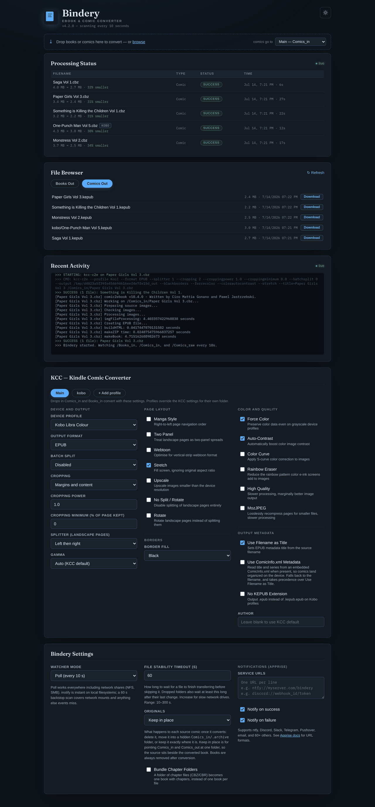

# 

[](https://github.com/jarynclouatre/bindery/actions/workflows/test.yml)

A self-hosted, Dockerized converter that automatically processes e-books and comics dropped into watched folders — no manual steps required.

**For Kobo users:** Converts `.epub` files to Kobo's native `.kepub` format using [kepubify](https://github.com/pgaskin/kepubify), giving you better performance and reading features than sideloaded EPUBs.

**For all devices:** Converts comic archives (`.cbz`, `.cbr`, `.zip`, `.rar`) into device-optimised files using [Kindle Comic Converter (KCC)](https://github.com/ciromattia/kcc), with full control over profile, cropping, splitting, gamma, and more.

All settings are configurable at runtime via a WebUI on port 5000 — no container rebuild needed. Supports `PUID`/`PGID` permission mapping for NAS and multi-user environments.

**Supported devices:** Kindle, Kobo, reMarkable, and any device KCC has a profile for.



---

## Quick Start

```bash
# 1. Copy docker-compose.yml from the repo and edit your paths
# 2. Find your user/group IDs
id
# → uid=1000(you) gid=1000(you)

# 3. Set PUID/PGID in docker-compose.yml, then start
docker compose up -d

# 4. Open the WebUI
http://<server-ip>:5000
```

---

## Folder Layout

```
bindery/
├── books_in/        ← drop .epub files here (Kobo users only)
├── books_out/       ← converted .kepub files appear here
├── comics_in/       ← drop .cbz / .cbr / .zip / .rar here
│   └── .archive/   ← originals preserved here when Preserve Originals is enabled
├── comics_out/      ← converted files appear here
├── comics_raw/      ← drop a flat folder of images here; Bindery zips it to CBZ and processes it automatically
│   ├── processed/   ← original image folders moved here on success
│   └── unprocessed/ ← folders with subfolders or no images moved here
└── config/          ← settings.json and jobs.json persisted here
```

All folders are created automatically on first run. Subfolder structure is preserved — a file at `comics_in/Marvel/issue01.cbz` will convert to `comics_out/Marvel/issue01.epub`. Books work the same way.

---

## docker-compose.yml

```yaml
services:
  bindery:
    image: dinkeyes/bindery:latest
    container_name: bindery
    ports:
      - "5000:5000"
    environment:
      - PUID=1000   # replace with your uid
      - PGID=1000   # replace with your gid
    volumes:
      - ./config:/app/config
      - /path/to/books_in:/Books_in
      - /path/to/books_out:/Books_out
      - /path/to/comics_in:/Comics_in
      - /path/to/comics_out:/Comics_out
      - /path/to/comics_raw:/Comics_raw
    restart: unless-stopped
    logging:
      driver: "json-file"
      options:
        max-size: "10m"
        max-file: "3"
```

---

## WebUI

The WebUI at port 5000 gives you full control over Bindery without touching config files or restarting the container.

### Processing Status

A live table shows every conversion job — filename, type, status (`queued` / `processing` / `success` / `failed`), timestamp, and elapsed time. Failed jobs show a **Retry** button that re-queues the file immediately. Job history is persisted in `/app/config/jobs.json` and survives container restarts (capped at 500 entries; oldest completed jobs are pruned first).

### File Browser

Browse and download files directly from `Books_out` and `Comics_out` without needing Samba, SSH, or any other file access method. Switch between the two output folders using the tab buttons. Files are listed newest first with size and date.

### Notifications

Bindery can send push notifications on conversion success and/or failure via [Apprise](https://github.com/caronc/apprise), which supports 60+ services including ntfy, Discord, Slack, Telegram, Pushover, and email. Enter one URL per line in the Service URLs box under Bindery Settings, check which events you want, and save.

Example URLs:
```
ntfy://your-ntfy-server.com/bindery
ntfy://bindery-alerts          ← uses the free ntfy.sh public server
discord://webhook_id/token
tgram://bot_token/chat_id
```

Full URL formats for every supported service are in the [Apprise docs](https://github.com/caronc/apprise/wiki).

---

## KCC Settings

All KCC settings are configured in the WebUI — each option includes a description inline. The most important settings to get right for your setup are:

- **Device Profile** — match your exact device for correct resolution. Default is `KoLC` (Kobo Libra Colour).
- **Output Format** — `EPUB` for Kobo, `MOBI` for Kindle.
- **Manga Style** — enables right-to-left page order; enable for manga.
- **Stretch** — fills the screen ignoring aspect ratio; on by default.
- **Splitter** — controls how landscape pages are split. Use `Right then left` for manga.

When **Device Profile** is set to **Generic / Custom**, width and height fields appear for custom resolutions.

---

## Bindery Settings

| Setting | Default | Notes |
|---------|---------|-------|
| Watcher Mode | `poll` | `poll` scans every 10 s and works everywhere including NFS/SMB. `inotify` detects files instantly but only works on local filesystems — files on network mounts will be silently missed. Requires a container restart to take effect. |
| File Stability Timeout | `60` s | How long Bindery waits for a file to finish transferring before skipping it. Increase for slow network drives. Range: 10–300 s. |
| Notifications (Apprise) | *(blank)* | One Apprise service URL per line. Leave blank to disable notifications. See [Apprise docs](https://github.com/caronc/apprise/wiki) for URL formats. |
| Preserve Originals | disabled | When enabled, source comics are moved to `Comics_in/.archive` after a successful conversion instead of being deleted. Subdirectory structure is mirrored. Has no effect on book conversions. |

---

## Behaviour

- Bindery watches `/Books_in`, `/Comics_in` and `/Comics_raw` using either **poll** mode (every 10 s, NAS/SMB/NFS compatible) or **inotify** mode (instant, local filesystems only).
- Each file gets a per-file lock so the same file is never processed twice concurrently.
- Subfolder structure is preserved — a file at `Comics_in/Marvel/issue01.cbz` converts to `Comics_out/Marvel/issue01.epub`.
- On success: converted file is moved to the output folder. Source file is deleted, or moved to `Comics_in/.archive` (mirroring subfolder structure) if **Preserve Originals** is enabled.
- On failure: source file is renamed to `<filename>.failed` and will not be retried automatically. Use the Retry button in the WebUI to re-queue it.
- Raw image folders in `Comics_raw` are held until stable (no file changes for 30 s) before processing begins.
- Live logs are shown in the WebUI and streamed to `docker logs`.

---

## Use Cases

Bindery fits anywhere in a self-hosted media pipeline:

- **[Calibre-Web Automated](https://github.com/crocodilestick/Calibre-Web-Automated)** — set `books_out` as the CWA ingest folder and converted `.kepub` files are imported to your library automatically
- **[Calibre](https://calibre-ebook.com/) auto-add** — point Calibre's Auto Add folder at `books_out` or `comics_out` for hands-free import
- **Cloud sync** — use rclone to push converted files to Google Drive, Dropbox, or any cloud storage automatically

---

## rclone Auto-Sync

Install rclone, configure a remote (`rclone config`), then run on a schedule with cron:

```bash
crontab -e
```

```
*/15 * * * * rclone sync /path/to/bindery/comics_out gdrive:Comics --log-file=/var/log/rclone-comics.log
*/15 * * * * rclone sync /path/to/bindery/books_out gdrive:Books --log-file=/var/log/rclone-books.log
```

Full setup instructions including systemd service and provider-specific remote configuration are at [rclone.org/docs](https://rclone.org/docs/).

---

## Updating

```bash
docker compose pull && docker compose up -d
```
